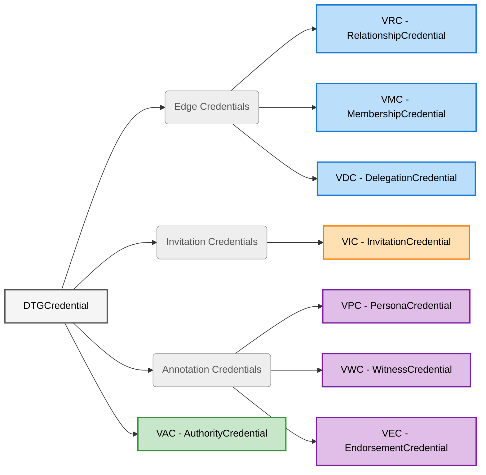

## DTG Credential Taxonomy

*This section is informative.*

This section provides a visual overview of the DTG Core Credential types and their formal type hierarchy. The functional categories (edge, invitation, annotation) are descriptive aids only; they do not appear in credential schemas. The [[ref: VAC]] belongs to none of them — it neither forms a graph edge nor annotates existing structure — and is shown attached directly to `DTGCredential`. See the editorial note in [VAC](#vac-verifiable-authority-credential).



### Formal W3C Type Hierarchy

```text
VerifiableCredential
└── DTGCredential
    ├── MembershipCredential (VMC)
    ├── RelationshipCredential (VRC)
    ├── DelegationCredential (VDC)
    ├── InvitationCredential (VIC)
    ├── PersonaCredential (VPC)
    ├── EndorsementCredential (VEC)
    ├── WitnessCredential (VWC)
    └── AuthorityCredential (VAC)
```

> **Note:** The [[ref: r-card]] (relationship card) that appeared in earlier drafts of this specification is a [[ref: verifiable data structure]] (VDS), not a `DTGCredential` subtype. It will be defined in the planned **DTG Verifiable Data Structures** specification (see [Related Specifications](#related-specifications)).

## W3C Verifiable Credentials Version Support

This section is normative.

### Primary Standard: v2.0

This specification is written using **W3C Verifiable Credentials Data Model v2.0** syntax. All DTG implementations MUST support v2.0 credential verification and SHOULD support v2.0 credential issuance.

### Legacy System Compatibility: v1.1

Many existing [[ref: identity verification providers]] (IDVPs), [trust registries](https://glossary.trustoverip.org/#term:trust-registry), and community infrastructure may only support W3C VC Data Model v1.1. To ensure broad interoperability and avoid forcing costly system migrations:

- DTG implementations SHOULD accept and verify v1.1 credentials
- Existing credential issuers MAY issue DTG-compliant credentials using v1.1 syntax
- New implementations SHOULD prioritize v2.0 but MAY also issue v1.1 when required by ecosystem constraints

> **Design Intent:** This dual-version support enables:
>
> - Legacy IDVPs to issue [[ref: IDVCs]] (identity verification credentials) without system upgrades
> - Existing [[ref: VTCs]] to participate in the DTG using their current infrastructure
> - Gradual ecosystem migration from v1.1 to v2.0 without breaking trust relationships

### Property Mapping

The only differences between v1.1 and v2.0 DTG credentials are:

| Property | v1.1 | v2.0 |
| ---------- | ------ | ------ |
| **Context** | `https://www.w3.org/2018/credentials/v1` | `https://www.w3.org/ns/credentials/v2` |
| **Issuance** | `issuanceDate` | `validFrom` |
| **Expiration** | `expirationDate` | `validUntil` |

All DTG-specific schemas (types, issuer requirements, credentialSubject structure) are identical.

> **Implementation Note:** Verifiers supporting both v1.1 and v2.0 credentials MUST be able to process proof types commonly used in both versions. Issuers SHOULD use well-supported proof types and include all necessary contexts.

### Dual-Version Examples

**v2.0 (Primary):**

```json
{
  "@context": [
    "https://www.w3.org/ns/credentials/v2",
    "https://firstperson.network/credentials/dtg/v1",
    "https://w3id.org/security/suites/ed25519-2020/v1"
  ],
  "type": ["VerifiableCredential", "DTGCredential", "MembershipCredential"],
  "issuer": "did:webvh:QmSbCcXWDDJmqE8m1nZ...:chess-club.example",
  "validFrom": "2026-01-06T10:00:00Z",
  "validUntil": "2027-01-06T10:00:00Z",
  "credentialSubject": {
    "id": "did:key:z6MkpTHR8VNs..."
  },
  "proof": {
    "type": "Ed25519Signature2020",
    "created": "2026-01-06T10:00:00Z",
    "proofPurpose": "assertionMethod",
    "verificationMethod": "did:webvh:QmSbCcXWDDJmqE8m1nZ...:chess-club.example#key-1",
    "proofValue": "z3FXQjecWJKT..."
  }
}
```

**v1.1 (Legacy Compatibility):**

```json
{
  "@context": [
    "https://www.w3.org/2018/credentials/v1",
    "https://firstperson.network/credentials/dtg/v1",
    "https://w3id.org/security/suites/ed25519-2020/v1"
  ],
  "type": ["VerifiableCredential", "DTGCredential", "MembershipCredential"],
  "issuer": "did:webvh:QmSbCcXWDDJmqE8m1nZ...:chess-club.example",
  "issuanceDate": "2026-01-06T10:00:00Z",
  "expirationDate": "2027-01-06T10:00:00Z",
  "credentialSubject": {
    "id": "did:key:z6MkpTHR8VNs..."
  },
  "proof": {
    "type": "Ed25519Signature2020",
    "created": "2026-01-06T10:00:00Z",
    "proofPurpose": "assertionMethod",
    "verificationMethod": "did:webvh:QmSbCcXWDDJmqE8m1nZ...:chess-club.example#key-1",
    "proofValue": "z3FXQjecWJKT..."
  }
}
```

> **Note:** All examples in this specification use v2.0 syntax unless explicitly labeled otherwise. When implementing v1.1 support, use the property mappings above.

## Correlation Scope

This section is normative.

Every [[ref: DTG verifiable identifier]] carries a declared **[[ref: correlation
scope]]**: the breadth over which its holder intends it to be correlated. Scope
is declared by the holder, and is independent of the role the holder plays —
which is established by the credentials the identifier appears in.

| Scope | Known to | Holder's intent |
|---|---|---|
| `pairwise` | exactly one counterparty | tells a verifier nothing beyond this one relationship |
| `community` | one [[ref: VTC]] | correlatable within that community and nowhere else |
| `linked` | a set the holder chooses | deliberate correlation across a chosen set |
| `public` | unbounded | published, meant to be found |

The values are **monotonic**, narrowest first. A holder MAY use a narrower scope
than a context requires; a verifier MUST NOT treat a narrower declaration as
satisfying a requirement for a wider one, nor infer a wider scope from an
identifier's value or from where it was encountered.

### Roles are conferred by credentials; scope is declared by the holder

This is the principle the rest of this section rests on. An identifier is not
"a membership identifier"; it is an identifier that *has* a
[[ref: VMC]]. It is not "a persona identifier"; it is one that *has* a
[[ref: VPC]]. The credential makes the role, and always did.

Two consequences follow, and both remove text rather than adding it:

**Uniqueness becomes definitional rather than normative.** An identifier
declared `pairwise` and then used with a second counterparty is not pairwise —
the declaration is false, and no separate MUST is needed to say a party shall
mint a fresh identifier per counterparty. What was a requirement plus a privacy
consideration explaining it is now what the word means.

**The public community stops being an anomaly.** A community that wishes to be
found declares `public` and is done. There is no bootstrapping problem and no
special case, because `public` is an ordinary value of the same axis rather than
an exception to a pairwise default.

### Declaring scope

A declaration is only meaningful if a verifier can read it, and this
specification deliberately does not yet fix where it is carried. Two placements
are viable and the choice has consequences worth deciding deliberately:

1. **In the credential, by the party whose identifier it is.** Each credential
   declares the scope of its *issuer's* identifier — the one party in a position
   to speak for it. Bidirectional [[ref: DTG edges]] make this complete on their
   own: in a [[ref: VMC]] pair the community declares its own scope in the
   grant and the member declares theirs in the acknowledgement, so both halves
   of the edge carry a first-party declaration.
2. **In the DID document**, resolved with the identifier and independent of any
   credential.

The first keeps the declaration signed by the party it describes and needs no
resolution step; the second states scope once rather than per credential, but
places it where a verifier must fetch it and where whoever hosts the document
can observe that fetch.

> **Editor's note:** This subsection states the question rather than settling
> it. The vocabulary and the principle above are the substance of this proposal
> and can be adopted independently of the carriage. Implementer input on the
> placement is specifically requested.

## Base Structure

This section is normative.

All DTG credentials share this W3C VC structure (v2.0 shown; see [Legacy System Compatibility](#legacy-system-compatibility-v11) for v1.1 compatibility):

**Schema:**

- `@context` (array, REQUIRED): MUST include `"https://www.w3.org/ns/credentials/v2"` and `"https://firstperson.network/credentials/dtg/v1"`, plus any additional contexts required by the proof type
- `type` (array, REQUIRED): MUST include `"VerifiableCredential"`, `"DTGCredential"`, and exactly one concrete subtype
- `issuer` (string, REQUIRED): DID of the issuing entity. Its [[ref: correlation scope]] is declared by the holder rather than encoded in the identifier — see [Correlation Scope](#correlation-scope)
- `validFrom` (string, REQUIRED): ISO 8601 datetime (`issuanceDate` in v1.1)
- `validUntil` (string, OPTIONAL): ISO 8601 datetime (`expirationDate` in v1.1)
- `credentialSubject` (object, REQUIRED):
  - `id` (string, REQUIRED): DID of the subject
  - Additional type-specific properties
- `taskContext` (string, OPTIONAL unless a credential type requires it): identifier (`threadId`) of the [trust task](https://glossary.trustoverip.org/#term:trust-tasks) exchange in which this credential was issued. See [Trust Task Context Binding](#trust-task-context-binding).
- `proof` (object, REQUIRED): W3C VC proof object

**Example:**

```json
{
  "@context": [
    "https://www.w3.org/ns/credentials/v2",
    "https://firstperson.network/credentials/dtg/v1",
    "https://w3id.org/security/suites/ed25519-2020/v1"
  ],
  "type": ["VerifiableCredential", "DTGCredential", "MembershipCredential"],
  "issuer": "did:example:vtcCommunityDid",
  "validFrom": "2026-01-06T10:00:00Z",
  "validUntil": "2027-01-06T10:00:00Z",
  "credentialSubject": {
    "id": "did:example:memberMdid"
  },
  "proof": {
    "type": "Ed25519Signature2020",
    "created": "2026-01-06T10:00:00Z",
    "proofPurpose": "assertionMethod",
    "verificationMethod": "did:example:vtcCommunityDid#key-1",
    "proofValue": "z3FXQjecWJKT..."
  }
}
```

### DID Method Considerations

*This subsection is informative.*

This specification does not mandate a [decentralized identifier](https://glossary.trustoverip.org/#term:decentralized-identifier) method. What a method must supply depends on what the identifier is required to do — chiefly how long it must remain verifiable and how widely its holder intends it to be correlated (its [[ref: correlation scope]]) — and a deployment may use different methods for different purposes. What follows states those properties in terms of the identifier's job, so implementers can judge whether a candidate method is suitable for any identifier in a deployment, including ones this specification does not otherwise name.

**Durable identifiers.** A [[ref: VTC]]'s identifier — declared `public` — issues [[ref: VMCs]] and is expected to outlive any particular key, operator, or hosting arrangement, and a member's identifier must stay verifiable across the lifetime of that membership. The determining property is how long the identifier must remain verifiable: a [[ref: VTA]] issuing [[ref: VWCs]] on behalf of a VTC, which [VWC (Verifiable Witness Credential)](#vwc-verifiable-witness-credential) permits in place of the member's own identifier, must be verifiable for as long as the attestations it issued are relied upon, and so belongs here too. A method used for these purposes should provide:

- **Verifiable key history**, so that a verifier can establish which key was authoritative when a credential was signed rather than only which key is authoritative now. This matters because a DTG credential may be presented long after issuance, and [Security Considerations](#security-considerations) requires verifiers to validate the verification method.
- **Key rotation without changing the identifier**, so that an edge of the graph survives key compromise. An identifier that cannot rotate makes every credential issued under it unrecoverable on compromise.
- **Pre-rotation or an equivalent commitment to successor keys**, limiting what an attacker holding a current key can do.
- **Independence from a single operator or hosting location**, so that loss of a domain does not sever the identifier from the graph built on it.
- **Discoverable service endpoints**, since the [[ref: VTA]] endpoints, `credentialStatus` mechanism, and [trust registry](https://glossary.trustoverip.org/#term:trust-registry) references relied on elsewhere in this specification are resolved through them.

Methods that publish a verifiable, append-only history of DID document versions — such as [did:webvh](https://identity.foundation/didwebvh/v1.0/), whose log entries commit to successor keys and may be countersigned by *DID log witnesses* — satisfy the first three properties. A DID log witness countersigns versions of a DID document and is a distinct role from the witness of a [[ref: VWC]], which attests to an edge; the two share only a name, and this subsection uses the qualified term wherever the DID log sense is meant.

Independence from a hosting location needs to be confirmed separately, because some methods make it a decision that can only be taken when the identifier is created. A `did:webvh` identifier resolves its log at a web origin and can be relocated only where the `portable` parameter was set in the first log entry; it defaults to off, and a later entry cannot enable it. Methods that separate the identifier from the location of its verification metadata — such as `did:scid`, under development at [ToIP](https://lf-toip.atlassian.net/wiki/spaces/HOME/pages/88572360/DID+SCID+Method+Specification), whose identifier is a self-certifying value that carries no location — do not present this choice at all. Implementers selecting a method for an identifier expected to outlive its current hosting arrangement should confirm both that the method supports relocation and that any capability which must be enabled at inception has been.

Methods that resolve to a document with no verifiable history, such as `did:web`, satisfy rotation and endpoint discovery but provide neither verifiable history nor any commitment to successor keys. Such a document is rotated by republishing it, which leaves a verifier unable to distinguish a legitimate rotation from a key substituted by an attacker, and unable to establish which key was authoritative at issuance.

**Narrow-scope identifiers (`pairwise` and `linked`).** A `pairwise` identifier is known to one counterparty; a `linked` identifier — a [[ref: persona]], for instance — is known to a set the holder chooses. Both exist to limit correlation, and both are expected to be created in quantity. A method used for these should provide:

- **Cheap creation with no registration step**, since a deployment may mint one identifier per relationship or per persona.
- **No shared resolution origin**, so that resolving one identifier does not reveal the existence of, or a common controller for, the others. See [Privacy Considerations](#privacy-considerations).
- **No dependency on infrastructure that observes identifier use**, since a party that resolves, or acts as a DID log witness for, many of a person's pairwise identifiers is positioned to correlate them regardless of the identifiers themselves.

Peer and key-based methods such as `did:peer` and `did:key` satisfy these properties. A method requiring each identifier to be published at a web origin is a poor fit for these roles even where it is the right choice for a `public` identifier, because the origin is common to every identifier published under it.

**Mixing methods.** Because the properties above pull in opposite directions — durability and recoverability against disposability and non-correlation — implementations should expect to use more than one method, rather than seeking a single method that serves every role. Nothing in this specification requires the `issuer` and `credentialSubject.id` of a credential to use the same method, and the examples throughout reflect this: durable issuers are shown with `did:webvh` and pairwise subjects with `did:key` or `did:peer`.

### Digest Encoding

Two credential types reference another credential by cryptographic digest rather than by identifier: the [[ref: VWC]] `digest` property, and the [[ref: VDC]] `delegation.parent` and `delegation.accepts` properties. All three MUST be encoded identically, as specified here.

A digest value MUST be produced as follows:

1. Serialize the referenced credential to its JSON representation and canonicalize it with the JSON Canonicalization Scheme ([JCS, RFC 8785](https://datatracker.ietf.org/doc/html/rfc8785)).
2. Compute the SHA-256 hash of the resulting UTF-8 bytes.
3. Form a Multihash value by prefixing the digest with the `sha2-256` algorithm header (`0x12`) and the digest length in bytes (`0x20`), each encoded as a varint, per [CID v1.0 §2.5](https://www.w3.org/TR/cid-1.0/#multihash).
4. Encode the resulting 34 bytes with the base-58-btc alphabet and prefix the Multibase header `z`, per [CID v1.0 §2.4](https://www.w3.org/TR/cid-1.0/#multibase-0).

This is the encoding defined for the `digestMultibase` property in [VC Data Integrity §2.6](https://www.w3.org/TR/vc-data-integrity/#resource-integrity). A digest of the empty string, for example, is expressed as:

```
zQmdfTbBqBPQ7VNxZEYEj14VmRuZBkqFbiwReogJgS1zR1n
```

Issuers MUST use base-58-btc so that a single canonical form exists for any given digest. Verifiers MUST NOT rely on string comparison to determine whether two digest values refer to the same credential: a conforming verifier decodes the Multibase value, decodes the Multihash to recover the algorithm identifier and the raw digest, and compares those. This requirement applies wherever the specification calls for digest values to match — notably when an acceptance VDC's `accepts` is matched against a grant, and when a derived VDC's `parent` is matched against the credential it derives from (see [Delegation Chains](#delegation-chains)).

Where a governing [[ref: VTC]] or [[ref: VTN]] requires a stronger hash, it MAY permit additional Multihash algorithm identifiers registered in [CID v1.0 §2.5](https://www.w3.org/TR/cid-1.0/#multihash). Because the algorithm is carried in the value itself, such a change does not alter the format of the property. Verifiers MUST reject a digest whose Multihash identifies an algorithm they do not accept, rather than treating it as a mismatch.

## Edge Credentials

This section is normative.

Edge credentials establish relationships between existing entities (nodes) in the DTG: [[ref: VRCs]] attest to relationships between two entities, [[ref: VMCs]] attest to community membership, and [[ref: VDCs]] attest that one entity has appointed another to act in its name. In each case, a bi-directional pair of credentials forms a complete [[ref: DTG edge]].

### VRC (Verifiable Relationship Credential)

**Purpose:** Attests to a relationship between two entities; two VRCs (one each direction) form a complete [[ref: DTG edge]].

**Schema:**

- `type` (array, REQUIRED): MUST include `"RelationshipCredential"`
- `issuer` (string, REQUIRED): the source party's identifier, typically declared `pairwise` (or `community` where the parties correlate within a shared [[ref: VTC]]) — see [Correlation Scope](#correlation-scope)
- `credentialSubject` (object, REQUIRED):
  - `id` (string, REQUIRED): the target party's identifier for this relationship

**Example:**

```json
{
  "@context": [
    "https://www.w3.org/ns/credentials/v2",
    "https://firstperson.network/credentials/dtg/v1",
    "https://w3id.org/security/suites/ed25519-2020/v1"
  ],
  "type": ["VerifiableCredential", "DTGCredential", "RelationshipCredential"],
  "issuer": "did:peer:2.Ez6LSbysKZ...",
  "validFrom": "2026-01-06T10:00:00Z",
  "credentialSubject": {
    "id": "did:peer:2.Ez6LSpSrLxn..."
  },
  "proof": { "//": "..." }
}
```

**Note:** a `pairwise` [[ref: correlation scope]] is RECOMMENDED for privacy; a `community`-scoped identifier is allowed for bootstrapping (see [Privacy Considerations](#privacy-considerations)).

#### Unilateral Relationship Identification

An identifier generated by a controller for the explicit purpose of establishing a VRC, and declared `pairwise`, serves as a globally unique identifier for that relationship edge from the perspective of the controller.

Therefore, a relationship within the DTG can be canonically identified by two independent identifiers:

- The source identifier (controlled by the Issuer)
- The target identifier (controlled by the Subject)

Semantic statements, metadata, or private context regarding the relationship MAY be anchored solely to the controller's own identifier, without requiring the resolution or inclusion of the counterparty's identifier.

> **Note:** Under [Correlation Scope](#correlation-scope) this no longer needs stating as a separate requirement. An identifier declared `pairwise` and then used with a second counterparty is not pairwise — the declaration is simply false. What was a normative MUST is now what the word means, and a party wanting the property declares it rather than being told to produce it.

#### Pairwise Zero-Knowledge Proof

The holder of a VRC MAY construct a zero-knowledge proof that demonstrates possession of a valid VRC and selectively discloses chosen attributes, subject DIDs, or predicates over them. A common application is to disclose the parties' `linked` persona identifiers while hiding the underlying `pairwise` ones, enabling a public, verifiable claim that two known [[ref: personas]] have a relationship without exposing the private pairwise channel between them or enabling correlation across the holder's other presentations. This construction is available to any two parties who hold a VRC between them, regardless of whether they share membership in a [[ref: VTC]]. It supports selective disclosure and minimal correlation across contexts. It does not by itself confer any community-level assurance (e.g., personhood); whatever assurance it carries derives from the parties' own out-of-band context, the public reputation attached to any disclosed persona DIDs, and the cryptographic integrity of the VRC.

### VMC (Verifiable Membership Credential)

**Purpose:** Attests to the membership of an entity in a [[ref: VTC]] or [[ref: VTN]]; two VMCs (one each direction) form a complete [[ref: DTG edge]].

**Schema:**

A VMC is issued in each direction of a membership edge. The two directions are distinguished by the issuer and subject rules below together with the presence of `digest`, not by separate type strings. Where both endpoints are `public` identifiers, as in VTN membership, the issuer and subject rules do not distinguish the directions and `digest` is the discriminator: a VMC carrying it is a member-issued acknowledgement, and a VMC without it is a community-issued grant.

- `type` (array, REQUIRED): MUST include `"MembershipCredential"`
- `issuer` (string, REQUIRED):
  - For the community-issued VMC (the membership grant): the VTC's or VTN's identifier, declared `public`
  - For the member-issued VMC (the membership acknowledgement): the member's identifier, typically declared `community` — or, for VTN membership, the member VTC's `public` identifier
- `credentialSubject` (object, REQUIRED):
  - `id` (string, REQUIRED):
    - For the community-issued VMC: the member's identifier (person/device/agent/service) — or, for VTN-to-VTC membership, the member VTC's `public` identifier
    - For the member-issued VMC: the VTC's or VTN's `public` identifier
  - `digest` (string, REQUIRED on the member-issued VMC, MUST be omitted on the community-issued VMC): A cryptographic hash of the community-issued VMC being acknowledged. The hash MUST be computed as the SHA-256 hash of the credential's JSON representation excluding its top-level `proof` member, canonicalized with the JSON Canonicalization Scheme ([JCS, RFC 8785](https://datatracker.ietf.org/doc/html/rfc8785)), and MUST be encoded as the string `sha256:` followed by the lowercase hexadecimal digest.

**Example (community-issued VMC — membership grant):**

```json
{
  "@context": [
    "https://www.w3.org/ns/credentials/v2",
    "https://firstperson.network/credentials/dtg/v1",
    "https://w3id.org/security/suites/ed25519-2020/v1"
  ],
  "type": ["VerifiableCredential", "DTGCredential", "MembershipCredential"],
  "issuer": "did:webvh:QmSbCcXWDDJmqE8m1nZ...:chess-club.example",
  "validFrom": "2026-01-06T10:00:00Z",
  "credentialSubject": {
    "id": "did:key:z6MkpTHR8VNs..."
  },
  "proof": { "//": "..." }
}
```

**Example (member-issued VMC — membership acknowledgement):**

```json
{
  "@context": [
    "https://www.w3.org/ns/credentials/v2",
    "https://firstperson.network/credentials/dtg/v1",
    "https://w3id.org/security/suites/ed25519-2020/v1"
  ],
  "type": ["VerifiableCredential", "DTGCredential", "MembershipCredential"],
  "issuer": "did:key:z6MkpTHR8VNs...",
  "validFrom": "2026-01-06T10:05:00Z",
  "credentialSubject": {
    "id": "did:webvh:QmSbCcXWDDJmqE8m1nZ...:chess-club.example",
    "digest": "sha256:9f2c4a17be0d3e5581cc7a4b6d90f3128e7ab5c46019d2f83b7e1a05cd64927f"
  },
  "proof": { "//": "..." }
}
```

#### Membership Edge Completion

A membership edge is complete only when both VMCs of the pair exist and are valid: the community-issued VMC that grants membership, and the member-issued VMC that acknowledges it.

The community-issued VMC MUST be issued first, and the member-issued VMC MUST carry a `digest` of it. A member-issued VMC whose `digest` does not match a valid community-issued VMC MUST NOT be treated as completing a membership edge.

Because the `digest` is computed over the credential's claims and not over its `proof`, an acknowledgement survives a re-proofing of the community-issued VMC it references: a re-signed grant carrying identical claims satisfies an existing acknowledgement. The member's consent binds to the membership granted, not to a particular signature over it.

Where the subject of a community-issued VMC demonstrates possession of that credential as evidence of its own membership, together with proof of control of the subject DID, a verifier MAY accept it alone. The demonstration is itself the member's participation, and it is available only to a party holding the subject's key — which is precisely what a community asserting someone's membership does not have. This holds whether the demonstration is a direct presentation or a possession statement carried inside a zero-knowledge proof. These are the cases that the [Community-Anchored Zero-Knowledge Proof](#community-anchored-zero-knowledge-proof) and [Personhood Credentials](#personhood-credentials-phc) rely on.

Where a [[ref: VTC]], [[ref: VTN]], or any party other than the member asserts that an entity is a member, the verifier MUST require the member-issued VMC. A community-issued VMC alone MUST NOT be accepted as evidence that the named entity is a member. A community asserting an entity's membership MUST be able to produce the member-issued VMC that completes the edge. The third statement of a [Community-Anchored Zero-Knowledge Proof](#community-anchored-zero-knowledge-proof) is a claim of this kind; that section states what a verifier may conclude from it.

The member-issued VMC is the member's consent artifact, and this is why the pair is required rather than a single directed credential. A community can always issue a credential naming someone as a member, but it cannot produce the acknowledgement without that party's signature. Requiring the acknowledgement therefore makes unconsented membership claims unprovable — and a community that cannot show one is visibly asserting a membership that was never agreed to.

> **Editor's note — membership lifecycle:** Withdrawal, revocation, and re-issuance of either VMC, and the protocol by which the pair is exchanged, are deferred to the planned DTG Core Trust Task Protocols specification (see [Related Specifications](#related-specifications)). Because the member is the issuer of the member-issued VMC, withdrawal of consent is self-sovereign and requires no cooperation from the community. The open question left to that specification is where a verifier discovers the status of a member-issued VMC, which must be under the member's control rather than the community's trust registry, so that a member never depends on the community to invalidate their own credential. Until that mechanism exists, a verifier can confirm that an acknowledgement matches its grant but cannot learn that it has since been withdrawn. Two interim controls follow from `digest` binding the acknowledgement to the grant's claims: a short `validUntil` on the community-issued VMC forces periodic re-acknowledgement, because a re-issued grant carries different claims and therefore a different digest that the earlier acknowledgement no longer matches; and a short `validUntil` on the member-issued VMC bounds how long the community holds a presentable proof of the member's consent (see [Privacy Considerations](#privacy-considerations)).

#### Community-Anchored Zero-Knowledge Proof

A VRC is a signed verifiable credential. It MAY be presented and verified using standard W3C VC presentation methods when privacy preservation is not required, and it SHOULD be presented using a zero-knowledge proof whenever privacy preservation is desired. Community membership is **not** a precondition for issuing, holding, or presenting a VRC; two entities that do not share (or do not hold) a [[ref: VMC]] can still exchange VRCs, and the resulting edges are valid trust attestations standing on their cryptographic signatures and on whatever real-world context the parties bring to them.

When both parties to a VRC hold VMCs from the same community, the holder MAY construct a community-anchored ZKP of the relationship. In such a proof, the holder demonstrates:

1. Possession of the VRC
2. Possession of the underlying community-issued VMC (proving membership in the community)
3. The VRC issuer possesses a community-issued VMC from the *same* community identifier

Statement 2 is a demonstration by the holder of a credential whose subject is the holder, and is the case the presentation rule in [Membership Edge Completion](#membership-edge-completion) covers. Statement 3 is not: it rests on a community-issued VMC whose subject is the VRC issuer rather than the holder, and under that rule a community-issued VMC alone does not establish that its subject is a member. The evidence that would establish it is the VRC issuer's own member-issued VMC — the acknowledgement of the grant that statement 3 refers to — which is signed by the issuer and names the community. Whether the holder obtains that acknowledgement in the course of exchanging VRCs, and how statement 3 is then proven in zero knowledge, are deferred to the trust task and ZK protocol work respectively (see the editor's note above and [Zero-Knowledge and Selective Disclosure](#zero-knowledge-and-selective-disclosure)). Until those are specified, a verifier of a community-anchored proof SHOULD treat statement 3 as establishing that the community attested the VRC issuer's membership, and SHOULD NOT treat it as establishing that the issuer acknowledged that membership.

This allows the relationship's existence to be proven within a shared community's governance context without revealing the specific DIDs or other credential details. Whatever assurances the community's trust registry attaches to its VMCs (e.g., personhood, when the VMCs qualify as [[ref: PHCs]]) carry forward into the proof.

This is one proof construction available to relationships within a shared community. Detailed ZK protocols and registry-ZK interactions are out of scope for this specification (see [Zero-Knowledge and Selective Disclosure](#zero-knowledge-and-selective-disclosure)).

**Note:** Implementations SHOULD make ZKP presentation the default behavior so that users obtain privacy preservation without having to opt in. See [Privacy Considerations](#privacy-considerations).

### VDC (Verifiable Delegation Credential)

**Purpose:** Attests that one entity (the delegator) has appointed another entity (the delegate) to act in the delegator's name, for a bounded set of acts, for a limited period, revocably. Within the appointed `scope`, what the delegate does is attributable to the delegator. Two VDCs — a grant and a matching acceptance — form a complete [[ref: DTG edge]].

A VDC differs from every other credential in this specification in kind, not only in payload. The [[ref: VRC]], [[ref: VMC]], [[ref: VIC]], [[ref: VPC]], [[ref: VEC]], and [[ref: VWC]] all *attest* that something is true about the graph; a verifier evaluates each as a claim and asks whether it is true. A VDC establishes *representation*; a verifier asks a different question — whether this party may stand in for that one, for this act, at this moment — and answering it requires steps that evaluating a claim does not: scope containment, chain resolution, invocation binding, and timely revocation. That is why delegation is defined as its own concrete subtype rather than expressed through the payload of an existing type.

#### Grant and Invocation

*This subsection is informative.*

Delegation divides cleanly along the test in [Credentials versus Trust Task Artifacts](#credentials-versus-trust-task-artifacts):

- **The grant** — "this delegator has appointed this delegate to act in its name, for this scope, until this time" — is true standing alone and outlives the exchange in which it was issued. It is a **credential**, defined here.
- **The invocation** — "the delegate is acting in the delegator's name, now, to do this particular thing" — is meaningful only inside the exchange in which it occurs. It is a **trust task artifact**, correlated by `threadId` and defined in the planned DTG Core Trust Task Protocols specification.

This specification therefore defines what a delegation *is* and how a verifier establishes that it is valid and in force. It does not define how a delegation is exercised.

#### Delegation and Authority

*This subsection is informative.*

Delegation and authority are distinct, and a VDC expresses only delegation. Keeping the two apart is what tells an implementer which credential to reach for.

- **Authority** answers *may this party do this thing?* The party acts **as itself**. What it does is attributed to it, and it may do it because it has been permitted to.
- **Delegation** answers *may this party act in another's name?* The delegate acts **as the delegator**. What it does within `scope` is attributed to the delegator, and is bounded by what the delegator could have done itself.

| Question | Answered by | The act is attributed to |
| ---------- | ------------- | -------------------------- |
| May this party do this thing, as itself? | authority — not defined in this specification | the party itself |
| May this party act in another's name? | delegation — the VDC | the entity in whose name it acts |

Neither implies the other. A service granted access to a person's mailbox may read that mail as itself; it has not thereby been appointed to send mail in that person's name. Conversely, a delegate appointed to correspond in a person's name holds that appointment whether or not it has been given access to any particular mailbox — and where it has not, the appointment gets it nowhere. The first is authority without delegation; the second is delegation without authority. A credential that conflated them would leave a verifier unable to tell which of the two it had been shown.

**When to use a VDC.** Ask whose name the act is performed in.

- **The actor's own name** — the actor is doing something it has been permitted to do, and the act is attributed to it. This is a question of authority, and a VDC is the wrong credential. This specification does not currently define a credential for it.
- **Another entity's name** — the actor is standing in for that entity, and the act is attributed to that entity. This is delegation, and a VDC is the credential that establishes it.

#### How a Delegation Composes with Authority

*This subsection is informative.*

A VDC neither carries authority nor confers it on the delegate. When a delegate presents a VDC and asks to perform an act, the verifier does not ask what the *delegate* is permitted to do, and it does not treat the VDC as a permission the delegator has handed over. It substitutes the delegator for the delegate and then asks the question it would have asked of the delegator directly. **A VDC moves the question; it does not answer it.**

Three checks, each independent of the others:

1. **Is this the delegate, and may it act in the delegator's name for this act?** Established by the VDC, together with [Delegation Chains](#delegation-chains) and [Invocation Binding](#invocation-binding). This specification defines this check.
2. **May the delegator perform this act?** Established by whatever the act requires of the delegator — community membership, a governance framework, an [[ref: IDVC]], a permission credential, or the verifier's own policy. This specification does not define this check, and a VDC does not influence its outcome.
3. **Must the delegate independently qualify?** A governance determination. Some communities will require a delegate to hold a [[ref: VMC]] of its own, or to satisfy the same requirements as any other actor, before it may act for anyone; others will not.

The reach of a delegation is the **intersection** of what the delegator may do and what the VDC chain appoints the delegate for — never the union, and never more than either.

Three consequences follow, and they answer the question of what, exactly, has been handed over:

- **Nothing the delegator holds is copied to the delegate.** A credential issued to the delegator remains the delegator's. The issuer's assurance about the delegator does not extend to the delegate, and a delegator cannot re-issue to a delegate what it was itself issued. A delegation is a statement by the delegator about who may speak in its name; it is not a transfer of anything the delegator was given.
- **Withdrawing the delegator's own permission ends the delegate's ability to act immediately**, without revoking the VDC, because check 2 is evaluated at the time of the act rather than at the time of the appointment. Revoking the VDC and withdrawing the underlying permission are different remedies with different reach, and a delegator may need either.
- **A `scope` may exceed what the delegator itself may do.** This is not an error: a delegator's own permissions change over the life of a durable appointment. A verifier MUST NOT treat such a `scope` as conferring anything beyond what check 2 allows, and issuers SHOULD NOT issue one as a matter of hygiene.

Credentials expressing authority are out of scope here. Confining the VDC to delegation leaves the [[ref: DTGWG]] free to define one separately — a verifiable authority credential, say — without reinterpreting the VDC or contending with it for the same semantic ground.

**Schema:**

- `type` (array, REQUIRED): MUST include `"DelegationCredential"`
- `issuer` (string, REQUIRED): DID of the delegator — an [[ref: R-DID]] or [[ref: M-DID]] for a person, device, or agent, a [[ref: C-DID]] where a community delegates to a [[ref: VTA]] or other service, or a [[ref: P-DID]] where the delegation is made under a [[ref: persona]]
- `validUntil` (string, REQUIRED): ISO 8601 datetime (`expirationDate` in v1.1). Unlike the base structure, `validUntil` is REQUIRED for a VDC: an appointment with no expiry cannot be reasoned about by a verifier that cannot reach the delegator.
- `credentialStatus` (object, REQUIRED): a W3C VC status mechanism through which a verifier can determine whether the delegation has been revoked. Revocation of a delegation is the mechanism by which a delegator withdraws an appointment already made, and MUST therefore be checkable by a verifier without contacting the delegator. The status mechanism used is determined by the governing [[ref: VTC]] or [[ref: VTN]].
- `credentialSubject` (object, REQUIRED):
  - `id` (string, REQUIRED): DID of the delegate
  - `delegation` (object, REQUIRED):
    - `scope` (array of strings, REQUIRED): the acts the delegate may perform in the delegator's name. MUST contain at least one entry; the vocabulary is defined by the governing VTC or VTN, as for the `endorsement` structure of a [[ref: VEC]]. A VDC MUST NOT express an unbounded appointment by omitting or emptying `scope`.
    - `parent` (string, OPTIONAL): the digest of the VDC from which this delegation was derived, when the delegator is itself acting under a delegation. Encoded exactly as the [[ref: VWC]] `digest` property: the SHA-256 hash of the parent credential canonicalized per [JCS, RFC 8785](https://datatracker.ietf.org/doc/html/rfc8785), expressed as a Multibase-encoded Multihash value. See [Digest Encoding](#digest-encoding). A VDC with no `parent` is a **root delegation**.
    - `maxDepth` (integer, OPTIONAL): the number of further re-delegations permitted below this one. A value of `0` prohibits re-delegation. When absent, re-delegation is prohibited.
    - `accepts` (string, OPTIONAL): present only in the acceptance direction; the digest of the grant being accepted, encoded as for `parent`. See [Delegation Edges](#delegation-edges).

**Example (grant):**

```json
{
  "@context": [
    "https://www.w3.org/ns/credentials/v2",
    "https://firstperson.network/credentials/dtg/v1",
    "https://w3id.org/security/suites/ed25519-2020/v1"
  ],
  "type": ["VerifiableCredential", "DTGCredential", "DelegationCredential"],
  "issuer": "did:peer:2.Ez6LSbysKZ...",
  "validFrom": "2026-01-06T10:00:00Z",
  "validUntil": "2026-04-06T10:00:00Z",
  "credentialStatus": {
    "id": "https://chess-club.example/status/3#94567",
    "type": "BitstringStatusListEntry",
    "statusPurpose": "revocation",
    "statusListIndex": "94567",
    "statusListCredential": "https://chess-club.example/status/3"
  },
  "credentialSubject": {
    "id": "did:key:z6MkpTHR8VNs...",
    "delegation": {
      "scope": ["schedule:read", "schedule:propose"],
      "maxDepth": 0
    }
  },
  "proof": { "//": "..." }
}
```

**Example (acceptance):**

```json
{
  "@context": [
    "https://www.w3.org/ns/credentials/v2",
    "https://firstperson.network/credentials/dtg/v1",
    "https://w3id.org/security/suites/ed25519-2020/v1"
  ],
  "type": ["VerifiableCredential", "DTGCredential", "DelegationCredential"],
  "issuer": "did:key:z6MkpTHR8VNs...",
  "validFrom": "2026-01-06T10:05:00Z",
  "validUntil": "2026-04-06T10:00:00Z",
  "credentialStatus": { "//": "..." },
  "credentialSubject": {
    "id": "did:peer:2.Ez6LSbysKZ...",
    "delegation": {
      "scope": ["schedule:read", "schedule:propose"],
      "accepts": "zQmdfTbBqBPQ7VNxZEYEj14VmRuZBkqFbiwReogJgS1zR1n"
    }
  },
  "proof": { "//": "..." }
}
```

#### Delegation Edges

A VDC whose `delegation` object has no `accepts` property is a **grant**: the delegator states the appointment it has made. A VDC whose `delegation` object has an `accepts` property is an **acceptance**: the delegate acknowledges the appointment it has taken on, and thereby the accountability that attaches to acting in another's name. Together they form a complete [[ref: DTG edge]], consistent with the bidirectional pairing of [[ref: VRCs]] and [[ref: VMCs]].

- In an acceptance, `issuer` MUST be the `credentialSubject.id` of the grant, and `credentialSubject.id` MUST be the `issuer` of the grant.
- In an acceptance, `delegation.scope` MUST be identical to the `scope` of the grant identified by `accepts`, so that what the delegate consented to is legible without resolving the grant.
- A verifier that relies on the delegate having knowingly taken on the appointment MUST obtain and verify the acceptance. A grant alone establishes what the delegator appointed, not what the delegate agreed to.

#### Delegation Chains

A delegate MAY appoint a further delegate only where the VDC it holds permits this, and only for a subset of the acts it was itself appointed for. Where a VDC carries a `parent`, verifiers MUST evaluate the whole chain:

1. Every VDC in the chain MUST independently satisfy the verification requirements of this specification, including proof verification, validity period, and revocation status.
2. The `scope` of each VDC MUST be a subset of the `scope` of the VDC identified by its `parent`. A verifier MUST reject any chain in which a delegation broadens the appointment it derives from.
3. The `validUntil` of each VDC MUST NOT be later than the `validUntil` of its parent.
4. Each step below a VDC bearing `maxDepth` reduces the permitted remaining depth by one. A verifier MUST reject a chain deeper than the shallowest `maxDepth` along it, and MUST reject any re-delegation below a VDC that omits `maxDepth` or sets it to `0`.
5. The chain MUST terminate in a root delegation whose `issuer` is the principal — the entity in whose name the acts would ultimately be performed. A verifier MUST establish that this principal is the party it intends to deal with; a chain that cannot be resolved to such a root establishes no representation. A governing [[ref: VTC]] or [[ref: VTN]] MAY additionally restrict which entities may delegate which acts, published via the applicable [trust registry](https://glossary.trustoverip.org/#term:trust-registry).

As with the [[ref: VWC]] `digest`, a `parent` value is only as useful as the verifier's access to the credential it references. Holders presenting a derived VDC SHOULD make the full chain available alongside it.

#### Invocation Binding

A VDC is not a bearer token. A verifier MUST NOT accept a party as acting in the delegator's name unless that party demonstrates control of the verification method associated with `credentialSubject.id` at the time of the request. A VDC presented without such a demonstration is evidence that a delegation exists; it is not evidence that the party presenting it is the delegate.

#### Relationship to Capability Models

*This subsection is informative.*

Chaining, attenuation, and invocation are well-explored outside the W3C VC data model, notably in [ZCAP-LD](https://w3c-ccg.github.io/zcap-spec/) and [UCAN](https://github.com/ucan-wg/spec). The VDC reuses their mechanics — attenuation-only re-delegation, chains resolving to a recognized root, and binding to a demonstration of key control at invocation — rather than inventing a different set.

The semantics differ, and the distinction in [Delegation and Authority](#delegation-and-authority) is exactly the one at issue: those models chain *permissions*, whereas a VDC chains *representation*. The mechanics are shared because both must answer how a grant narrows as it passes down a chain and how it is bound to the party invoking it, not because the thing being passed is the same.

The VDC expresses those mechanics as a DTG credential, rather than referencing an external capability token, for two reasons. First, a delegation is a durable edge of the graph and is expected to be reasoned about alongside the other DTG edges. Second, this specification's schemas are kept minimal so that holders can satisfy predicates in zero knowledge; an opaque embedded token would place the one payload a verifier most needs to reason about — the scope — outside the reach of that machinery. Mappings between VDCs and these formats are left to future work.

## Invitation Credentials

This section is normative.

### VIC (Verifiable Invitation Credential)

**Purpose:** Authorizes a prospective member to join a [[ref: VTC]] or [[ref: VTN]] when presented to the [[ref: VTA]]/[[ref: PEP]]. The [[ref: DTG invitation credential]] has two functional variants distinguished by issuer and subject rules (not by separate type strings): the [[ref: VTC invitation credential]] and the [[ref: VTN invitation credential]].

**Schema:**

- `type` (array, REQUIRED): MUST include `"InvitationCredential"`
- `issuer` (string, REQUIRED):
  - For VTC invitation: the VTC's `public` identifier, or an authorized member's identifier (per policy)
  - For VTN invitation: the VTN's `public` identifier, or a member VTC's (per policy)
- `credentialSubject` (object, REQUIRED):
  - `id` (string, REQUIRED):
    - For VTC invitation: the prospective member's identifier, or a prospective VTC's `public` identifier
    - For VTN invitation: the prospective VTC's `public` identifier

**Example (VTC member invitation):**

```json
{
  "@context": [
    "https://www.w3.org/ns/credentials/v2",
    "https://firstperson.network/credentials/dtg/v1",
    "https://w3id.org/security/suites/ed25519-2020/v1"
  ],
  "type": ["VerifiableCredential", "DTGCredential", "InvitationCredential"],
  "issuer": "did:key:z6MkhaXgBZD...",
  "validFrom": "2026-01-06T10:00:00Z",
  "validUntil": "2026-02-06T10:00:00Z",
  "credentialSubject": {
    "id": "did:key:z6MkpTHR8VNs..."
  },
  "proof": { "//": "..." }
}
```

> **Editor's note — roles and access control:** Roles and access control policy details are primarily inferred from the issuer plus the [trust registry](https://glossary.trustoverip.org/#term:trust-registry). An earlier open question for this Working Draft was whether any of this information should be embedded in the VIC itself. It should not: what a party may *do* is conferred by a [[ref: VAC]] (see [Authority Credentials](#authority-credentials)), which can be reissued or attenuated without touching the invitation that admitted them.

## Annotation Credentials

This section is normative.

Annotation credentials **do not create graph structure**. They attach data to existing edges or parties.

### VPC (Verifiable Persona Credential)

**Purpose:** Links a [[ref: persona]], asserted under a `linked`-scoped identifier, to an existing relationship — enabling the holder to control intentional correlation across relationships.

**Schema:**

- `type` (array, REQUIRED): MUST include `"PersonaCredential"`
- `issuer` (string, REQUIRED): the identifier under which the persona is asserted, declared `linked`
- `credentialSubject` (object, REQUIRED):
  - `id` (string, REQUIRED): the counterparty's identifier as used in the relationship (typically `pairwise`, or `community` within a shared VTC)

**Example:**

```json
{
  "@context": [
    "https://www.w3.org/ns/credentials/v2",
    "https://firstperson.network/credentials/dtg/v1",
    "https://w3id.org/security/suites/ed25519-2020/v1"
  ],
  "type": ["VerifiableCredential", "DTGCredential", "PersonaCredential"],
  "issuer": "did:key:z6MkrKqT9pL...",
  "validFrom": "2026-01-06T10:00:00Z",
  "credentialSubject": {
    "id": "did:peer:2.Ez6LSpSrLxn..."
  },
  "proof": { "//": "..." }
}
```

### VWC (Verifiable Witness Credential)

**Purpose:** Third-party attestation that an edge was established under specific conditions. The witness may be a person or a [[ref: VTA]] applying the witnessing policies of a [[ref: VTC]] — for example, verifying that both parties were present at the same event, or provided proof of biometric liveness at the time of relationship formation.

Because the meaning of a witness attestation depends on the conditions under which the witnessing occurred, a VWC MUST be bound to the [trust task](https://glossary.trustoverip.org/#term:trust-tasks) exchange in which it was issued via the `taskContext` property (see [Trust Task Context Binding](#trust-task-context-binding)).

A witnessed exchange of a complete [[ref: DTG edge]] is bidirectional: two edge credentials, one in each direction, are formed in a single witnessing event — two VRCs for a peer-to-peer edge, or the two VMCs of a membership edge. For such exchanges the witness SHOULD issue one VWC per direction. In each VWC, `credentialSubject.id` MUST be the DID of the issuer of the edge credential that the VWC attests (the credential referenced by `digest`), so that the two VWCs of an exchange are unambiguously bound to their respective directions.

A VWC's `credentialSubject.id` and `taskContext` alone identify only the observed party and the trust task exchange, not the edge being witnessed. Binding a VWC to a specific edge therefore requires `digest`: a verifier holding the referenced edge credential can recover both endpoints of the edge (the credential's `issuer` and `credentialSubject.id`) and confirm the exact credential the witness attested to. This binding is only as strong as the verifier's access to that credential — a `digest` without the referenced credential to hand is an opaque hash, not an identified edge. Issuers and holders presenting a VWC as evidence of a specific edge SHOULD make the referenced edge credential available alongside it.

**Schema:**

- `type` (array, REQUIRED): MUST include `"WitnessCredential"`
- `issuer` (string, REQUIRED): the witness's identifier — a member's, or that of a [[ref: VTA]] acting according to VTC policy
- `taskContext` (string, REQUIRED): `threadId` of the trust task exchange in which the witnessing occurred
- `credentialSubject` (object, REQUIRED):
  - `id` (string, REQUIRED): DID of the observed party
  - `digest` (string, REQUIRED): A cryptographic hash of the witnessed VRC, binding the VWC to the specific edge established. The hash MUST be computed as the SHA-256 hash of the credential's JSON representation canonicalized with the JSON Canonicalization Scheme ([JCS, RFC 8785](https://datatracker.ietf.org/doc/html/rfc8785)), and MUST be encoded as a Multibase-encoded Multihash value, as defined for the `digestMultibase` property in [VC Data Integrity §2.6](https://www.w3.org/TR/vc-data-integrity/#resource-integrity). The Multihash MUST use the `sha2-256` algorithm (header `0x12`, length `0x20`) and the Multibase encoding MUST be base-58-btc (prefix `z`), both as defined in [Controlled Identifiers v1.0](https://www.w3.org/TR/cid-1.0/). See [Digest Encoding](#digest-encoding).
  
    The same requirement applies to the `digest` that a member-issued [[ref: VMC]] carries of the community-issued VMC it acknowledges: a mismatch invalidates the acknowledgement, and the membership edge is not complete.
  - `witnessContext` (object, OPTIONAL): Context of the witnessing event
    - `event` (string, OPTIONAL): Human-readable event name
    - `sessionId` (string, OPTIONAL): Session or nonce identifier
    - `method` (string, OPTIONAL): Verification method used

**Example:**

```json
{
  "@context": [
    "https://www.w3.org/ns/credentials/v2",
    "https://firstperson.network/credentials/dtg/v1",
    "https://w3id.org/security/suites/ed25519-2020/v1"
  ],
  "type": ["VerifiableCredential", "DTGCredential", "WitnessCredential"],
  "issuer": "did:webvh:QmVzTd9hRkPqLu4WgXyN...:witness-service.example",
  "validFrom": "2026-01-06T10:00:00Z",
  "taskContext": "thread-abc-123",
  "credentialSubject": {
    "id": "did:key:z6MkpTHR8VNs...",
    "digest": "zQmdfTbBqBPQ7VNxZEYEj14VmRuZBkqFbiwReogJgS1zR1n",
    "witnessContext": {
      "event": "EthDenver 2024",
      "sessionId": "session-abc-123",
      "method": "in-person-proximity"
    }
  },
  "proof": { "//": "..." }
}
```

### VEC (Verifiable Endorsement Credential)

**Purpose:** Attaches endorsements (skills, reputation) to a party. The verifiability applies to cryptographic assurance in the issuer's signature, not to the truth of the assertions, whose vocabulary is defined by the governing [[ref: VTC]] or [[ref: VTN]].

**Schema:**

- `type` (array, REQUIRED): MUST include `"EndorsementCredential"`
- `issuer` (string, REQUIRED): DID of the endorser
- `credentialSubject` (object, REQUIRED):
  - `id` (string, REQUIRED): DID of the endorsed party
  - `endorsement` (object, REQUIRED): Community/VTN-defined endorsement structure
    - Structure and fields determined by community policy

**Example:**

```json
{
  "@context": [
    "https://www.w3.org/ns/credentials/v2",
    "https://firstperson.network/credentials/dtg/v1",
    "https://w3id.org/security/suites/ed25519-2020/v1"
  ],
  "type": ["VerifiableCredential", "DTGCredential", "EndorsementCredential"],
  "issuer": "did:key:z6MkhaXgBZD...",
  "validFrom": "2026-01-06T10:00:00Z",
  "credentialSubject": {
    "id": "did:key:z6MkpTHR8VNs...",
    "endorsement": {
      "type": "SkillEndorsement",
      "name": "Software Development",
      "competencyLevel": "expert"
    }
  },
  "proof": { "//": "..." }
}
```

## VAC (Verifiable Authority Credential)

This section is normative.

A VAC confers permission. It differs from every other credential here in what it
does to the graph: an edge credential establishes that two nodes are connected,
an annotation credential attaches a claim to structure that already exists, and
an invitation credential bootstraps a node into a community. A VAC creates none
of those. It states what a party **may do** within a scope that some node
governs.

The distinction that matters most is between a VAC and a [[ref: VEC]]. An
endorsement is a statement *about* a party — that they are skilled, trusted, or
of good standing — and a verifier decides for itself what to do with that
statement. A VAC is a statement *to* a verifier: the issuer, who governs the
scope, has decided. Conflating the two puts a decision that belongs to the
governing party into a claim that reads as reputation, and leaves verifiers to
infer permission from adjectives.

> **Editorial note — placement.** This is deliberately a section rather than a
> new "Authority Credentials" category, following the reasoning in
> [issue #28](https://github.com/trustoverip/dtgwg-cred-spec/issues/28): a
> category with a single member is the structural problem that issue exists to
> remove, and adding a fourth one would repeat it. If #28 lands as proposed, the
> VAC and the VIC sit as peer sections after the two real categories. If the WG
> would rather keep categories, this section is one heading away from becoming
> one.

**Purpose:** Confers authority on a party to perform specified actions within a
named scope governed by the issuer.

**Schema:**

- `type` (array, REQUIRED): MUST include `"AuthorityCredential"`
- `issuer` (string, REQUIRED): DID of the party that governs the scope — a
  [[ref: C-DID]], the DID of a [[ref: DTG node]] such as a shared resource, or
  the [[ref: M-DID]] of a holder attenuating authority they themselves hold
  (see *Attenuation* below)
- `credentialSubject` (object, REQUIRED):
  - `id` (string, REQUIRED): DID of the party receiving the authority
  - `authority` (object, REQUIRED):
    - `scope` (string, REQUIRED): the DID or URI the authority applies to. A
      verifier MUST reject a VAC whose `scope` does not match the resource
      being accessed; scope matching is exact unless the governing party
      publishes a containment rule.
    - `actions` (array of strings, REQUIRED): the permitted actions, drawn
      from a vocabulary the governing party defines. MUST NOT be empty — an
      empty array is not a wildcard, and a verifier MUST treat it as
      conferring nothing. Action strings are compared as exact,
      case-sensitive strings; a verifier MUST NOT infer that one action
      implies another (`"admin"` does not grant `"write"` unless the
      governing party's VAC says both).
    - `parent` (string, OPTIONAL): the `id` of the VAC this one was attenuated
      from. Absent means this VAC was issued directly by the governing party.
    - `audience` (string, OPTIONAL): a DID that MUST be the presenter for this
      VAC to be accepted. Absent means any holder may present it.
- `validUntil` (string, RECOMMENDED): authority that does not expire is
  authority nobody can withdraw by waiting.

**Example (a member granted write access to a shared resource):**

```json
{
  "@context": [
    "https://www.w3.org/ns/credentials/v2",
    "https://firstperson.network/credentials/dtg/v1",
    "https://w3id.org/security/suites/ed25519-2020/v1"
  ],
  "type": ["VerifiableCredential", "DTGCredential", "AuthorityCredential"],
  "id": "urn:uuid:6f5c1b2a-9d4e-4a77-8c31-1e0b7a5d2f90",
  "issuer": "did:webvh:z6Mkw...:example.com:rooms:7f3a",
  "validFrom": "2026-01-06T10:00:00Z",
  "validUntil": "2026-07-06T10:00:00Z",
  "credentialSubject": {
    "id": "did:key:z6MkpTHR8VNs...",
    "authority": {
      "scope": "did:webvh:z6Mkw...:example.com:rooms:7f3a",
      "actions": ["read", "write", "curate"]
    }
  },
  "proof": { "//": "..." }
}
```

### Attenuation

A VAC holder MAY issue a further VAC conferring a **subset** of the authority
they hold, without involving the governing party. This is what allows a party to
equip an agent, a device, or a short-lived session with only the authority that
task requires, rather than lending it their own.

An attenuated VAC:

- MUST set `issuer` to the attenuating holder's DID.
- MUST set `authority.parent` to the `id` of the VAC being attenuated.
- MUST NOT confer any action absent from the parent's `actions`.
- MUST NOT specify a `validUntil` later than the parent's.
- MUST NOT widen `scope`.
- SHOULD set `audience` to the party expected to present it.

**Verification.** A verifier presented with a VAC that carries `parent` MUST
verify the entire chain to a VAC issued by the governing party, and MUST reject
the chain if any link widens what its parent conferred, in actions, scope, or
validity period. A verifier that checks only the presented credential has
verified nothing: attenuation is only a narrowing if somebody walks the chain.

**The holder presents the chain; the verifier does not fetch it.** A
presentation carrying an attenuated VAC MUST include every VAC from the
presented one up to and including the one issued by the governing party. A
verifier MUST NOT dereference `authority.parent` over the network to obtain a
link it was not given, and MUST reject a chain it cannot complete from the
presentation alone.

This is a deliberate constraint, not an omission. Resolving parents by
dereference would make verification depend on network availability, turn every
`id` into a server-side request the verifier can be induced to make against an
address of the holder's choosing, and leak to the issuer — or to whoever hosts
the identifier — when and how often a credential is used. Bearer-side
presentation keeps verification offline, constant in its network behaviour, and
free of that correlation channel. `id` values in a chain are therefore
identifiers, not locators, and need not resolve to anything.

**Chain depth is bounded.** A verifier MUST enforce a maximum chain depth and
MUST NOT accept a chain of more than **8** VACs including the one issued by the
governing party. Chain verification is linear in depth and runs on every
presentation, so an unbounded chain is a denial-of-service vector against the
verifier. The known uses need far less — a person attenuating to an agent is
depth 2, and an agent attenuating to a sub-agent is depth 3 — so issuers SHOULD
stay well below the ceiling, and a party finding itself near it should treat
that as a signal the authority is being re-delegated further than intended.

**Example (a member attenuating read-only, short-lived authority to their AI agent):**

```json
{
  "@context": [
    "https://www.w3.org/ns/credentials/v2",
    "https://firstperson.network/credentials/dtg/v1",
    "https://w3id.org/security/suites/ed25519-2020/v1"
  ],
  "type": ["VerifiableCredential", "DTGCredential", "AuthorityCredential"],
  "id": "urn:uuid:b81d0f44-2c17-4e59-9f6a-3d5c8e7a1042",
  "issuer": "did:key:z6MkpTHR8VNs...",
  "validFrom": "2026-01-06T10:00:00Z",
  "validUntil": "2026-01-06T14:00:00Z",
  "credentialSubject": {
    "id": "did:key:z6MkfR2aQ9Xv...",
    "authority": {
      "scope": "did:webvh:z6Mkw...:example.com:rooms:7f3a",
      "actions": ["read"],
      "parent": "urn:uuid:6f5c1b2a-9d4e-4a77-8c31-1e0b7a5d2f90",
      "audience": "did:key:z6MkfR2aQ9Xv..."
    }
  },
  "proof": { "//": "..." }
}
```

### Authority is not delegation

A VAC authorizes its subject to act **in their own name**, within a scope. It
does not authorize acting *on behalf of* another party, and a verifier MUST NOT
read it as doing so. The two are separate questions — *may this party do this
here?* and *may this party stand in for that one?* — and answering both with one
credential means a verifier cannot tell which it has been shown.

> **Editor's note — the `actions` vocabulary is deliberately open, and that
> has a cost.** Each governing party defines its own action strings, which is
> what lets a room, a community and a service each grant what makes sense for
> it without a registry negotiating between them. The cost is that `"write"`
> issued by one governing party carries no defined relationship to `"write"`
> issued by another: the strings are only meaningful within the scope that
> issued them, and a verifier that generalises across scopes is reading
> something the specification does not say. That is tolerable while authority
> is checked by the party governing the scope, which is the case this
> specification describes. It would need revisiting if VACs are ever expected
> to be interpreted across governance boundaries — a shared core vocabulary
> with room for extension is the obvious answer, and is deliberately not
> attempted here.

> **Editor's note — identifying service nodes, and why
> [issue #22](https://github.com/trustoverip/dtgwg-cred-spec/issues/22) already
> fixes it.** Adding services to the node types surfaces a gap: the four VID
> types ([[ref: R-DIDs]], [[ref: M-DIDs]], [[ref: C-DIDs]], [[ref: P-DIDs]])
> describe a member, a community, a persona, or a peer, and a mediator or trust
> registry is none of those — though it holds an identifier and forms edges like
> any other node.
>
> That is the same defect #22 identifies rather than a new one: each VID name
> encodes both *what the identifier is attached to* and *how widely it may be
> correlated*, and the role half is already carried by the credential the
> identifier appears in. A service node has nowhere to go precisely because the
> taxonomy enumerates roles. Under #22's correlation-scope axis it needs no new
> type at all — a mediator's identifier is simply `public`, and #22's principle
> that **roles are conferred by credentials, scope is declared by the holder**
> is exactly what a VAC does for a service: the credential says what it may do,
> the identifier says only how far it may be correlated.
>
> A VAC is unaffected either way, since `scope` is a DID or URI rather than a
> typed VID. Recorded here as a further data point for #22, not as a competing
> proposal.

> **Editor's note — this is the credential the VDC left room for.**
> [PR #19](https://github.com/trustoverip/dtgwg-cred-spec/pull/19) proposes a
> **verifiable delegation credential** covering acting-on-behalf-of, and draws
> the same line from the other side: its own table records *"May this party do
> this thing, as itself? — authority, **not defined in this specification**"*,
> and it states that the word *authority* is deliberately left free so that
> "if the WG later wants a verifiable authority credential, it can be defined
> without reinterpreting the VDC or contending with it for the same semantic
> ground."
>
> This is that credential, and the two are complementary rather than
> overlapping: a VDC moves the question of authority to the delegator; a VAC
> answers it. The reach of a delegated act is the intersection of what the VDC
> appoints the delegate for and what the delegator may itself do — and after
> this section, that second half has a credential that can express it. Note
> also that #19 proposes the VDC as an **edge** credential, so no shared
> category question arises.

### Authority and membership are separate credentials

A VAC does not attest membership and MUST NOT be accepted as evidence of it; a
[[ref: VMC]] does not confer authority and MUST NOT be accepted as evidence of
that. Keeping them separate lets a governing party change what a member may do
without touching the membership edge, and lets a holder prove authority without
proving which member they are.

Where a verifier requires **both** — that the presenter is a member *and* holds
authority — and the presentation is a zero-knowledge proof that withholds the
subject identifier, the presentation MUST include a proof that both credentials
share the same subject. Without it, two parties may pool credentials: one
contributes membership, the other contributes authority, and the combination
verifies as a single party holding both. See
[Zero-Knowledge and Selective Disclosure](#zero-knowledge-and-selective-disclosure).

## Trust Task Context Binding

This section is normative.

DTG credentials are frequently issued during broader multi-step exchanges — [trust tasks](https://glossary.trustoverip.org/#term:trust-tasks) carried out through ceremonies governed by a [[ref: VTC]] or [[ref: VTN]]. A credential exchanged inside such a ceremony can be cryptographically valid as an artifact while still being insufficient evidence that the ceremony reached its intended terminal state. This section defines the mechanism that prevents such credentials from escaping their task context and being misinterpreted.

### Credentials versus Trust Task Artifacts

*This subsection is informative.*

The boundary between this specification and the planned DTG Core Trust Task Protocols specification is drawn by the following test:

- A **credential** is a durable claim about the graph that is true standing alone (e.g., VRC, VMC, VPC). It lives on after the exchange in which it was issued.
- An **artifact** is a work-product of a trust task (intermediate or completion), only meaningful within its exchange. It is carried as a Trust Task document, correlated by a shared `threadId`, with its terminal state expressed at the trust task layer — not as a new credential type.

**Test for any new thing:** true outside the exchange? → credential. Only meaningful inside? → artifact.

All seven credential types in this specification pass the credential side of this test. The [[ref: VDC]] is the boundary case that most clearly illustrates it: the delegation grant is durable and passes, while the invocation of a delegation does not and is left to the trust task layer (see [Grant and Invocation](#grant-and-invocation)). The structure of trust task completion artifacts (outcome evidence) is out of scope for this specification and will be defined in the DTG Core Trust Task Protocols specification.

### The `taskContext` Property

A credential whose meaning depends on a trust task completing MUST carry a `taskContext` property containing the `threadId` of the originating trust task exchange. This requirement is a property of the credential type, not a per-issuer choice:

- For credential types where this specification marks `taskContext` as REQUIRED (currently only the [[ref: VWC]]), issuers MUST include it.
- For all other DTG credential types, `taskContext` is OPTIONAL.
- A DTG credential without a `taskContext` property MUST be interpretable standing alone, independent of any exchange.

### Outcome Interpretability

A verifier MUST NOT interpret a `taskContext`-bearing credential as proof that the associated trust task or ceremony completed unless the matching trust task outcome evidence is also present and verified. That outcome evidence MUST be reachable by the verifier — either it travels with the presentation, or the `taskContext` value enables the verifier to locate it.

## Supporting Concepts

*This section is informative.*

### Personhood Credentials (PHC)

A [[ref: PHC]] is the community-issued [[ref: VMC]] (the membership grant) issued by a [[ref: VTC]] whose governance enforces:

- Real human personhood
- Exactly one membership per person

No additional schema fields are required. PHC status is determined by governance and trust registries, not by credential structure. Issuers may optionally add `"PersonhoodCredential"` to the `type` array as a non-authoritative hint.

A grant is a PHC whether or not the member has acknowledged it. The member may present an unacknowledged grant as evidence of their own membership under the presentation rule in [Membership Edge Completion](#membership-edge-completion); the acknowledgement gates only the community's ability to assert that membership to others. "Exactly one membership per person" is counted over grants, and is enforced by governance rather than by credential structure.

**Example:**

```json
{
  "type": [
    "VerifiableCredential",
    "DTGCredential",
    "MembershipCredential",
    "PersonhoodCredential"
  ],
  "issuer": "did:webvh:QmRfN7pKwEbTs2LcMqDh...:government-idv.example",
  "credentialSubject": {
    "id": "did:key:z6MkpTHR8VNs..."
  }
}
```

### Trust Registries

- **Authoritative source** for roles ([[ref: initiator]], [trust anchor](https://glossary.trustoverip.org/#term:trust-anchor), member, [[ref: IDVP]], etc.)
- Map DIDs to roles and policies
- Determine acceptable issuers
- Schema and APIs out of scope for this specification
- Handle revocations, etc.

### Identity Verification Credentials (IDVC)

- [[ref: IDVCs]] are **not** `DTGCredential` subtypes
- Any W3C VC satisfying a VTC/VTN's identity-proofing requirements
- Issuers, assurance levels, and requirements governed by VTC/VTN policy and trust registries

### Zero-Knowledge and Selective Disclosure

- This specification is **format-agnostic** (no binding to BBS+, SD-JWT-VC, etc.)
- Two ZKP constructions are defined for proving relationships: the [Pairwise Zero-Knowledge Proof](#pairwise-zero-knowledge-proof) (available to any two VRC holders) and the [Community-Anchored Zero-Knowledge Proof](#community-anchored-zero-knowledge-proof) (available when both parties hold VMCs from the same community)
- Schemas are kept simple to enable common predicates:
  - "Holder has valid community-issued VMC from recognized VTC"
  - "Issuer is authorized member"
  - "Two distinct VRCs exist"
  - "Holder has a valid, unrevoked delegation to act in the name of a member of a recognized VTC, covering act X"
- Detailed ZK protocols and registry-ZK interactions are left to future work

## Security Considerations

*This section is informative.*

1. **Proof verification.** Verifiers must cryptographically verify the `proof` of every DTG credential, including resolution of the issuer's DID and validation of the verification method, before relying on any claim in the credential.
2. **Validity period enforcement.** Verifiers must reject credentials outside their `validFrom`/`validUntil` window (or v1.1 equivalents) and should check applicable revocation status via the governing trust registry.
3. **Issuer authorization.** A cryptographically valid credential is not necessarily an authorized one. Verifiers must evaluate whether the issuer is authorized for the claimed role (e.g., a community-issued VMC's issuer being a recognized VTC, a member-issued VMC's issuer being the subject of the grant it acknowledges, a VIC issuer being permitted to invite) using the applicable trust registry or governance framework.
4. **Digest integrity.** A verifier relying on a VWC's binding to a specific edge must have the referenced edge credential available, recompute the SHA-256 hash over its JCS (RFC 8785) canonical form with the top-level `proof` member removed, and confirm it matches `digest`; a mismatch invalidates the attestation. Without the referenced credential in hand, `digest` cannot be resolved to an edge, and the VWC should not be treated as evidence of which edge was witnessed. The same requirement applies to the `digest` that a member-issued VMC carries of the community-issued VMC it acknowledges: a mismatch invalidates the acknowledgement, and the membership edge is not complete.
5. **Context collapse.** A credential presented outside the trust task exchange in which it was issued may be misinterpreted as evidence of a completed ceremony. The requirements of [Trust Task Context Binding](#trust-task-context-binding) exist to prevent this class of attack and must be enforced by verifiers.
6. **Replay of invitation credentials.** VICs should be issued with short validity periods and should be treated as single-use by the accepting [[ref: VTA]]/[[ref: PEP]], to prevent replay of an intercepted invitation.
7. **Key compromise.** Compromise of the private key controlling any DID used in a DTG credential (issuer or subject) undermines all credentials anchored to it. Key rotation and revocation procedures are governed by the applicable DID methods and trust registries.
8. **Unconsented membership assertion.** A community-issued VMC alone does not establish that the named entity agreed to be a member, since a community can issue one without that party's involvement. Verifiers evaluating a membership claim made by anyone other than the member should require the member-issued VMC of the pair, per [Membership Edge Completion](#membership-edge-completion).
9. **Misreading a VDC as a claim (VDC).** A [[ref: VDC]] establishes representation rather than asserting a fact, so a verifier that evaluates it with the logic it applies to the other DTG credentials will accept a party as standing in for another without having bounded what that party may then do. Verifiers must apply the scope, chain, and invocation requirements of [VDC (Verifiable Delegation Credential)](#vdc-verifiable-delegation-credential) in full, and must not accept a syntactically valid VDC as representation for anything outside its `scope`.
10. **Treating a delegation as a permission (VDC).** A VDC establishes that the delegate may act in the delegator's name; it says nothing about whether the act requested is one the delegator could perform. A verifier that treats a valid VDC as sufficient grounds to proceed lets a delegate do in the delegator's name what the delegator could not do itself, and a verifier that evaluates the delegate's own permissions instead of the delegator's answers the wrong question entirely. The checks are independent and must each be made, as set out in [How a Delegation Composes with Authority](#how-a-delegation-composes-with-authority).
11. **Delegation chain escalation (VDC).** Re-delegation that broadens scope, extends validity beyond the parent, or exceeds the permitted depth converts a narrow appointment into a wide one. Verifiers must evaluate every VDC in a chain, not only the one presented, and must reject any chain that does not resolve to a root delegation issued by the principal in whose name the acts would be performed.
12. **Delegation revocation latency (VDC).** Revocation is the delegator's only means of withdrawing an appointment already made, and its usefulness is bounded by how recently the verifier checked. Verifiers should check `credentialStatus` within a freshness window defined by the governing VTC or VTN, and delegators should keep `validUntil` as short as the delegated purpose allows rather than relying on revocation alone.
13. **Bearer use of a VDC.** A VDC that is presented without a demonstration of key control by the delegate proves only that a delegation exists. Verifiers must enforce [Invocation Binding](#invocation-binding); otherwise a captured VDC is usable by whoever holds a copy of it.
14. **Personhood laundering via delegation.** A [[ref: PHC]] asserts that its holder is a real person with exactly one membership. Because a delegate's acts are attributable to the delegator, a verifier that cannot distinguish the two may credit an agent with its principal's personhood, and may credit several agents of one person as several people. Verifiers must treat an act performed under a VDC as an act by the delegate in the delegator's name — never as an act by the delegator in person — and communities whose governance depends on personhood should state whether delegated acts are recognized at all.
15. **Authority chain verification.** A [[ref: VAC]] carrying `authority.parent` confers nothing on its own. Verifiers must verify every link to a VAC issued by the party governing the scope, and reject the chain if any link widens the actions, scope, or validity period its parent conferred. Verifying only the presented credential accepts a self-issued grant of arbitrary authority.
16. **Chain resolution is bearer-side by design.** Verifiers must not dereference `authority.parent` to fetch a link they were not presented. Doing so makes verification depend on network availability, exposes the verifier to server-side request forgery against an address the holder chooses, and signals credential use to whoever hosts the identifier.
17. **Chain depth is a denial-of-service surface.** Verification is linear in depth and runs on every presentation, so the maximum-depth rule is a resource bound, not a stylistic one.
18. **Credential pooling under zero-knowledge presentation.** Where membership and authority are proven together with the subject identifier withheld, a verifier must require proof that both credentials share a subject. Otherwise two parties can combine one's membership with the other's authority and present as a single party holding both.

## Privacy Considerations

*This section is informative.*

1. **Reusing a wider-scope identifier.** Reusing a `community`- or `linked`-scoped identifier across multiple relationships is allowed for bootstrapping, but implementers should weigh the correlation it invites. Migrating those edges to `pairwise` identifiers after bootstrapping is recommended. Note that under [Correlation Scope](#correlation-scope) this is a choice of declared scope rather than a change of identifier type.
2. **Pairwise really means pairwise.** Reusing one identifier across counterparties creates the correlation a `pairwise` declaration promises to avoid. Under [Correlation Scope](#correlation-scope) such reuse does not weaken a requirement so much as falsify a declaration the holder made — which is the more useful thing for a verifier to be able to say.
3. **Intentional correlation via personas.** Correlation across relationships should occur only through the holder's deliberate assertion of a [[ref: persona]] (via a [[ref: VPC]]) or through an identifier the holder has deliberately declared at a wider scope — never as a side effect of credential structure.
4. **Minimal disclosure.** DTG credential schemas are intentionally minimal so that holders can satisfy common predicates (membership, relationship existence) using zero-knowledge or selective disclosure mechanisms without revealing underlying DIDs or credential contents.
5. **Witness data.** The optional `witnessContext` of a [[ref: VWC]] may reveal information about where and when parties met. Issuers should include only what the witnessing purpose requires, and holders should be able to withhold `witnessContext` details when proving the attestation.
6. **ZKPs by default.** Implementations should use ZKP presentation by default so that privacy preservation does not require any extra effort on behalf of users.
7. **Correlation through the resolution layer.** Correlation does not require the credentials themselves. Where several of a party's narrow-scope identifiers resolve through common infrastructure — a shared web origin, a shared registry, or a shared set of DID log witnesses countersigning their updates — that infrastructure can associate identifiers that the credential structure was designed to keep apart, and can observe when each is used. Choosing a DID method for these is therefore a privacy decision as much as a key management one; see [DID Method Considerations](#did-method-considerations).
8. **The acknowledgement as a disclosure artifact.** A member-issued VMC is a signed, transferable credential naming both the member and the community, and it is held by the community. It exists so that a community cannot assert a membership it is unable to prove — but the same property lets the community prove that membership to a third party without the member's involvement, which a community-issued VMC alone did not allow. Members should treat issuing an acknowledgement as a durable and delegable disclosure of the membership, should acknowledge from an identifier declared `community` for that community (see item 1) so that it does not correlate across communities, and may bound the disclosure with a short `validUntil` (see the editor's note in [Membership Edge Completion](#membership-edge-completion)). This specification defines no selective-disclosure or zero-knowledge form for the acknowledgement, so a community proving membership to a third party currently discloses the whole credential.
9. **Delegation correlation.** A [[ref: VDC]] links a delegator and a delegate, and every invocation of it exposes that link to the verifier. Delegators should issue VDCs against a `pairwise` identifier scoped to the context in which the appointment will be exercised rather than against a wider-scoped one used across contexts, so that a delegate's activity in one context does not correlate its principal's activity in another.
10. **Scope terms as identifiers.** The `scope` of a VDC is community-defined text that may be narrow enough to identify the delegator, the delegate, or the underlying arrangement. Issuers should choose scope vocabularies that are no more specific than the appointment requires, and holders should be able to prove scope containment in zero knowledge rather than disclosing the full `scope` array.

## Governance Considerations

*This section is informative.*

This specification deliberately delegates most policy decisions to the governance frameworks of individual [[ref: VTCs]] and [[ref: VTNs]], consistent with the [ToIP Governance Metamodel](https://trustoverip.org/wp-content/uploads/ToIP-Governance-Metamodel-Specification-V1.0-2021-12-21.pdf):

1. Membership criteria, invitation policies, and identity-proofing requirements (including acceptable [[ref: IDVPs]] and [[ref: IDVCs]]) are defined by each community's governance framework and published via trust registries.
2. Whether a [[ref: VMC]] qualifies as a [[ref: PHC]] is a governance determination, not a schema property.
3. Endorsement vocabularies for [[ref: VECs]] and witnessing policies for [[ref: VWCs]] are defined by the governing VTC or VTN.
4. Delegation scope vocabularies for [[ref: VDCs]], the status mechanism used for their revocation, the freshness window within which verifiers must check it, and whether delegated acts are recognized at all where personhood is required, are defined by the governing VTC or VTN.
5. Whether a delegate must independently qualify — hold a [[ref: VMC]] of its own, or meet the same requirements as any other actor — before it may act in another's name is a governance determination, not a property of the VDC. A VDC establishes only that the appointment was made; see [How a Delegation Composes with Authority](#how-a-delegation-composes-with-authority).
6. New credential types proposed by higher-layer trust task protocol specifications are expected to be coordinated between the DTGWG task forces responsible for credentials and trust tasks.

## Internationalization Considerations

*This section is informative.*

Human-readable values in DTG credentials (e.g., endorsement names, witness event names) are community-defined and may appear in any language. Detailed internationalization guidance will be completed before this specification advances beyond Working Draft status.

## Accessibility Considerations

*This section is informative.*

This specification defines data structures rather than user interfaces. Accessibility guidance for implementations presenting DTG credentials to users will be completed before this specification advances beyond Working Draft status.

## Conformance

This section is normative.

This specification defines normative requirements, using the keywords defined in [Requirements Language](#requirements-language), for the following conformance targets:

### Conformance Targets

1. **Issuers** — entities that issue DTG credentials. A conforming issuer MUST produce credentials that satisfy the [Base Structure](#base-structure) and the schema of the concrete credential type, including the `taskContext` requirements of [Trust Task Context Binding](#trust-task-context-binding).
2. **Holders** — entities that store and present DTG credentials. A conforming holder MUST present credentials without altering their contents and MUST include reachable trust task outcome evidence when presenting `taskContext`-bearing credentials as evidence of task completion.
3. **Verifiers** — entities that verify DTG credentials and presentations. A conforming verifier MUST implement the verification requirements of the [Security Considerations](#security-considerations) and the outcome interpretability rule of [Trust Task Context Binding](#trust-task-context-binding), and MUST support W3C VC Data Model v2.0 verification per [W3C Verifiable Credentials Version Support](#w3c-verifiable-credentials-version-support). A verifier that accepts [[ref: VACs]] MUST additionally implement the chain verification rule of [Attenuation](#attenuation).

### Conformance Tests

Conformance test suites for this specification have not yet been defined and are expected to be developed as the specification matures toward Working Group Approved Deliverable status.

## References

### Normative References

- [W3C Verifiable Credentials Data Model v2.0](https://www.w3.org/TR/vc-data-model-2.0/)
- [W3C Verifiable Credentials Data Model v1.1](https://www.w3.org/TR/vc-data-model/)
- [W3C Decentralized Identifiers (DIDs) v1.0](https://www.w3.org/TR/did-1.0/)
- [IETF RFC 2119: Key words for use in RFCs to Indicate Requirement Levels](https://datatracker.ietf.org/doc/html/rfc2119)
- [IETF RFC 8785: JSON Canonicalization Scheme (JCS)](https://datatracker.ietf.org/doc/html/rfc8785)
- [W3C Verifiable Credential Data Integrity v1.0](https://www.w3.org/TR/vc-data-integrity/)
- [W3C Controlled Identifiers (CIDs) v1.0](https://www.w3.org/TR/cid-1.0/)
- [ISO 8601: Date and time format](https://www.iso.org/iso-8601-date-and-time-format.html)

### Informative References

- [ToIP Trust Registry Query Protocol](https://trustoverip.github.io/tswg-trust-registry-protocol/)
- [ToIP Governance Metamodel Specification V1.0](https://trustoverip.org/wp-content/uploads/ToIP-Governance-Metamodel-Specification-V1.0-2021-12-21.pdf)
- [Trust Tasks (ToIP Glossary)](https://glossary.trustoverip.org/#term:trust-tasks) and the community proposals at [trusttasks.org](https://www.trusttasks.org)
- [IETF RFC 7095: jCard: The JSON Format for vCard](https://datatracker.ietf.org/doc/html/rfc7095)
- [Agent2Agent (A2A) Protocol: AgentCard](https://agent2agent.info/docs/concepts/agentcard/)
- [Personhood Credentials (arXiv:2408.07892)](https://arxiv.org/abs/2408.07892)
- [Authorization Capabilities for Linked Data (ZCAP-LD)](https://w3c-ccg.github.io/zcap-spec/)
- [User Controlled Authorization Networks (UCAN)](https://github.com/ucan-wg/spec)
- [W3C Bitstring Status List v1.0](https://www.w3.org/TR/vc-bitstring-status-list/)
- [DTG Credentials v0.3 proposal draft](https://github.com/trustoverip/dtgwg-cred-tf/blob/main/dtg.md) (superseded by this specification)
